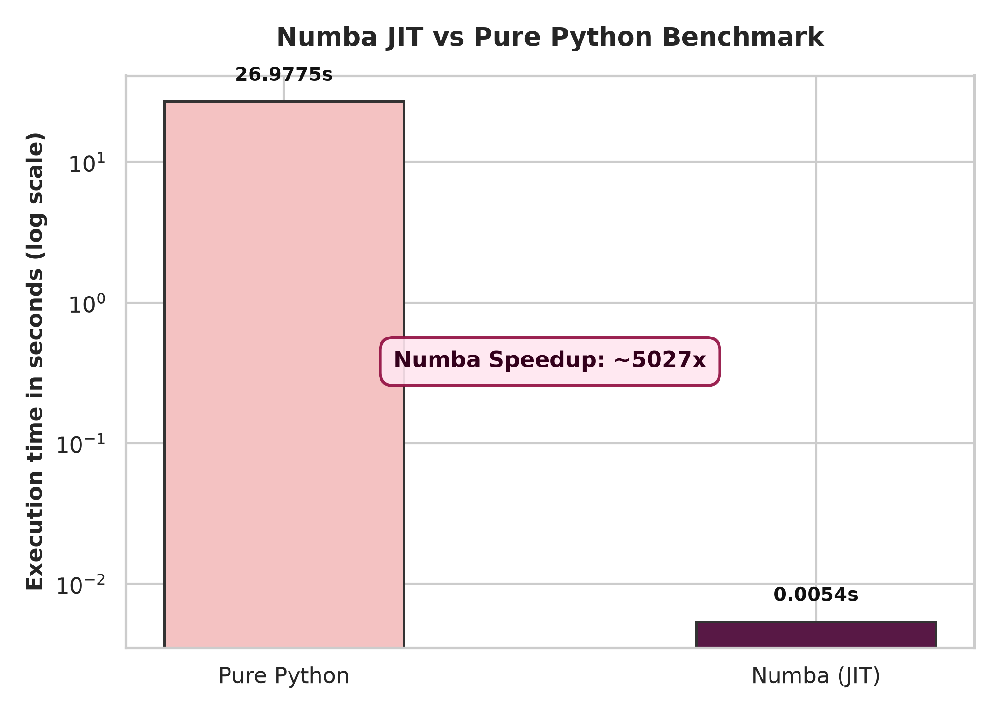
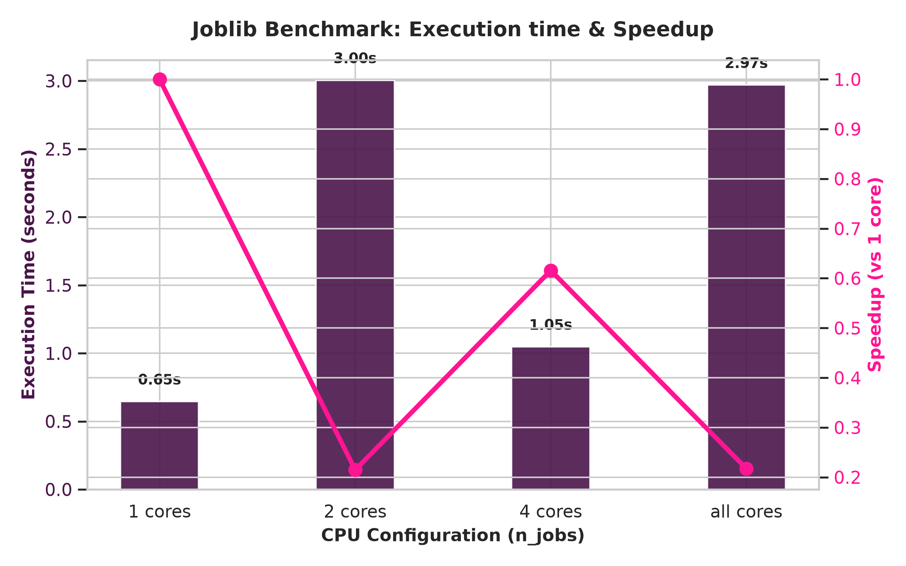

Performance Report
==================

This document reports the results of the benchmarks performed on the HPC components of the Winery Adventures project. The tests were used to evaluate the impact of JIT compilation with Numba and parallelization with Joblib on execution times.

Methodology and Dataset
-----------------------

The benchmarks were performed using a dataset generated through ``data_generator.py``, containing more than 100,000 measurements distributed across 100 tanks.

The tests focus on two main aspects:

* the comparison between the pure Python implementation and the Numba-compiled implementation;
* the behavior of the pipeline when varying the number of cores used by Joblib.

1. Numba Optimization (JIT)
---------------------------

The fermentation stress calculation compares the different measurements belonging to the same tank. The algorithm has :math:`O(n^2)` complexity, so execution time can increase rapidly as the number of measurements grows.

The ``pairwise_stress_function`` function was compiled with Numba using ``@jit(nopython=True)``. A short warm-up was performed before the measurement, so that the time required for the initial compilation was not included in the benchmark.

**Benchmark results (Linux):**

* **Pure Python:** ~26.97 seconds
* **Numba JIT:** ~0.0054 seconds
* **Speedup:** over 5000x

The benchmark shows a substantial reduction in execution time for this part of the computation. The reported speedup is the value measured during the test and may vary depending on the hardware and environment configuration.

2. Parallelization with Joblib
------------------------------

The stress calculation is performed separately for each tank, allowing the workload to be distributed across multiple processes.

To evaluate the effect of parallelization, the pipeline was executed with different ``n_jobs`` values: 1, 2, 4, and -1. The value ``-1`` uses all available cores.

In the benchmark considered, the configuration with 1 core achieved the best execution time, while using more cores did not provide any further improvement.

The results show that increasing the number of cores does not necessarily lead to a proportional reduction in execution time. The overhead introduced by parallelization can in fact offset part of the benefit gained from using additional resources.

Conclusions
-----------

The benchmarks demonstrate the contribution of the two techniques used to optimize the HPC pipeline.

Numba significantly reduces the execution time of the pairwise calculation compared to the pure Python implementation, while Joblib allows the workload to be distributed across multiple cores, parallelizing the computation at the tank level.

The results depend on the hardware used and on the distribution of the data. Therefore, the reported values should be considered as the results of the benchmark performed, rather than as absolute performance values for Numba or Joblib.